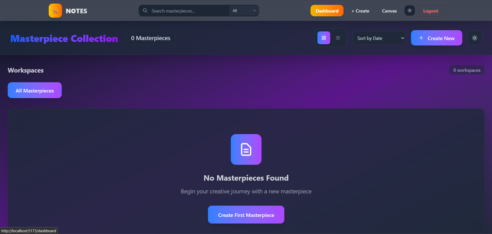
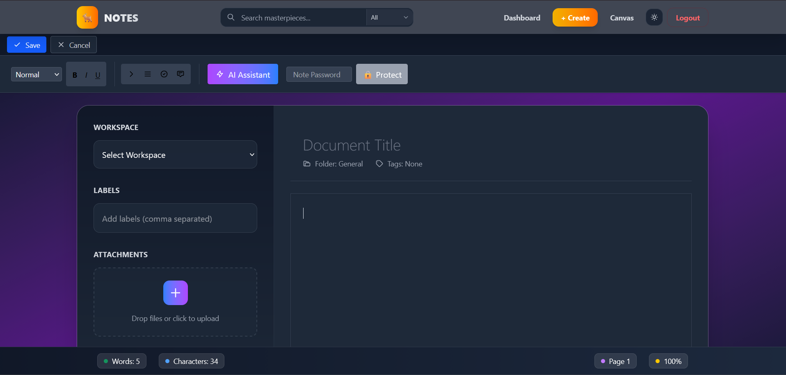
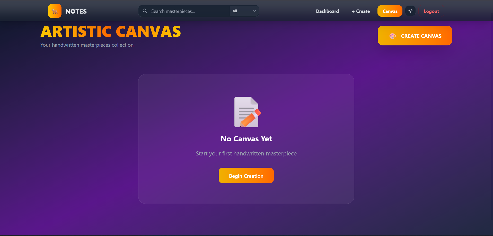
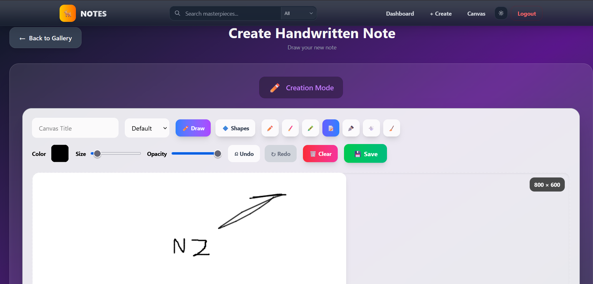
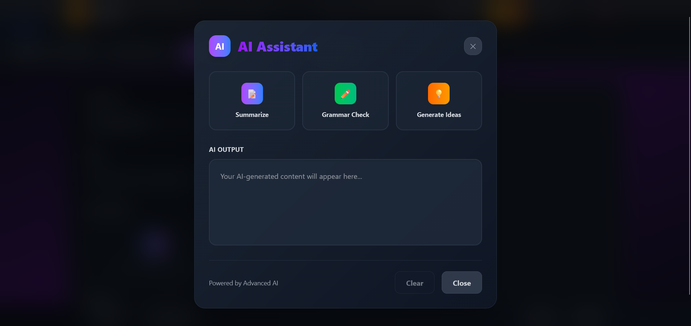

# 📝 Note-Taking App — MERN + TypeScript + Tailwind

<div align="center">


**A modern, responsive Note-Taking web application with persistent storage and clean UI.**

</div>

---

## 🖼️ Preview

| Dashboard | Add Note | Canvas Dashboard |
|------------|-----------|------------------|
|  |  |  |

| Create Canvas | AI Assistant |
|---------------|---------------|
|  |  |

---

## ✨ Overview

The **Note-Taking App** is a full-stack web application built using the **MERN stack** (MongoDB, Express, React, Node.js) with **TypeScript** and **Tailwind CSS**.  
It allows users to create, edit, and delete notes with persistent storage, providing a fast, minimalist, and responsive experience.

This project demonstrates:
- Clean folder separation (client/server)
- RESTful API design
- React state management using Context
- Responsive UI with TailwindCSS
- Scalable TypeScript + Express backend

---

## 🚀 Core Features

### 🧠 Notes Management
- Create, edit, delete, and view notes  
- Notes are saved to a MongoDB database  
- Auto-save and manual save supported  

### 🎨 Modern UI/UX
- Built with **React + TailwindCSS**  
- Fully responsive (Desktop → Mobile)  
- Smooth animations and modern layout  

### 🔒 Data & Performance
- Persistent storage via **MongoDB Atlas**  
- REST API endpoints with **Express.js**  
- Secure CORS and environment variable management  

### 🧩 Extensible
- Can be extended to support user authentication (JWT/Firebase Auth)  
- Supports future additions like search, tags, dark mode  

---

## 🏗️ Architecture

```

┌────────────────────────────────────────────┐
│                 Client Layer               │
├────────────────────────────────────────────┤
│ React 18 │ TypeScript │ Tailwind CSS │ Vite │
│ Components • Context • Hooks • Pages       │
└────────────────────────────────────────────┘
│
┌────────────────────────────────────────────┐
│                 Server Layer               │
├────────────────────────────────────────────┤
│ Node.js │ Express.js │ RESTful Endpoints    │
│ Routes • Controllers • Models • Middlewares│
└────────────────────────────────────────────┘
│
┌────────────────────────────────────────────┐
│                Database Layer              │
├────────────────────────────────────────────┤
│ MongoDB │ Mongoose ORM │ Atlas Cluster     │
└────────────────────────────────────────────┘

```

---

## 🧮 Tech Stack

| Layer | Technology | Description |
|:------|:------------|:-------------|
| **Frontend** | React + TypeScript | UI development with component-based design |
| **Styling** | Tailwind CSS | Modern utility-first responsive framework |
| **Backend** | Node.js + Express.js | RESTful API handling and routing |
| **Database** | MongoDB | Cloud NoSQL database for persistence |
| **Tools** | Vite, ESLint, Prettier | Fast build tool and linting |
| **Version Control** | Git + GitHub | Source code management |

---

## 📁 Folder Structure

```

Note-Taking-App/
├── client/                     # React Frontend
│   ├── public/                 # Static assets (favicon, icons)
│   ├── src/
│   │   ├── components/         # UI components (NoteCard, NoteForm, Navbar)
│   │   ├── context/            # Context API for state management
│   │   ├── hooks/              # Custom React hooks
│   │   ├── pages/              # Main pages (Home, Notes)
│   │   ├── App.tsx             # Root App component
│   │   ├── main.tsx            # React DOM entry
│   │   └── index.css           # Tailwind styles
│   └── package.json
│
├── server/                     # Backend API
│   ├── controllers/            # Business logic (noteController.ts)
│   ├── models/                 # Mongoose schemas (Note.ts)
│   ├── routes/                 # API endpoints (noteRoutes.ts)
│   ├── index.ts                # Entry point for Express app
│   ├── config/                 # DB connection setup
│   └── package.json
│
├── .env.example                # Example environment file
├── .gitignore
├── README.md
└── package.json

````

---

## ⚙️ Setup & Installation

### 🧩 Prerequisites
- Node.js ≥ 16  
- npm or yarn  
- MongoDB Atlas account (for database connection)

### 🔧 Installation Steps

```bash
# 1️⃣ Clone the repository
git clone https://github.com/KAquib24/Note-Taking-App.git
cd Note-Taking-App

# 2️⃣ Install dependencies for frontend and backend
cd client && npm install
cd ../server && npm install
````

### ⚙️ Environment Variables

Create a `.env` file inside `/server`:

```env
PORT=5000
MONGODB_URI=your_mongodb_connection_string
```

### 🚀 Run the App Locally

```bash
# Start backend (in /server)
npm run dev

# Start frontend (in /client)
npm run dev
```

> App will run at **[http://localhost:3000](http://localhost:3000)**

---

## 🧱 API Endpoints

| Method   | Endpoint         | Description             |
| :------- | :--------------- | :---------------------- |
| `GET`    | `/api/notes`     | Get all notes           |
| `POST`   | `/api/notes`     | Add a new note          |
| `PUT`    | `/api/notes/:id` | Update an existing note |
| `DELETE` | `/api/notes/:id` | Delete a note           |

---

## 🎯 Future Enhancements

* ✅ User Authentication (JWT/Firebase)
* ✅ Search and Tag System
* ✅ Rich Text Editor Integration
* ✅ Dark / Light Theme Toggle
* ✅ Deploy Full MERN App to Render / Vercel

---

## 🧠 Learning Goals

This project demonstrates:

* Integration of **React + Node.js + MongoDB**
* Clean folder separation for scalability
* TypeScript usage on both client and server
* Modern UI patterns with TailwindCSS
* Environment variable management and REST APIs

---

## 🧾 License

This project is licensed under the **MIT License**.
See [LICENSE](LICENSE) for details.

---

## ✉️ Contact

**👨‍💻 Aquib Khan**
📧 [aquibkhan8108@gmail.com](mailto:aquibkhan8108@gmail.com)
🔗 [GitHub — @KAquib24](https://github.com/KAquib24)

---

<div align="center">

⭐ **If you like this project, give it a star on GitHub!** ⭐
*“Small steps every day lead to big results.”*

</div>
```
